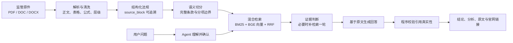
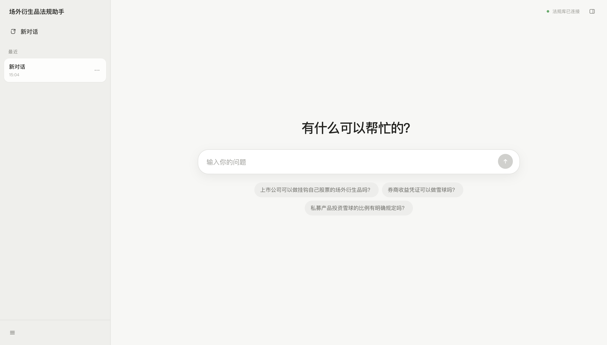
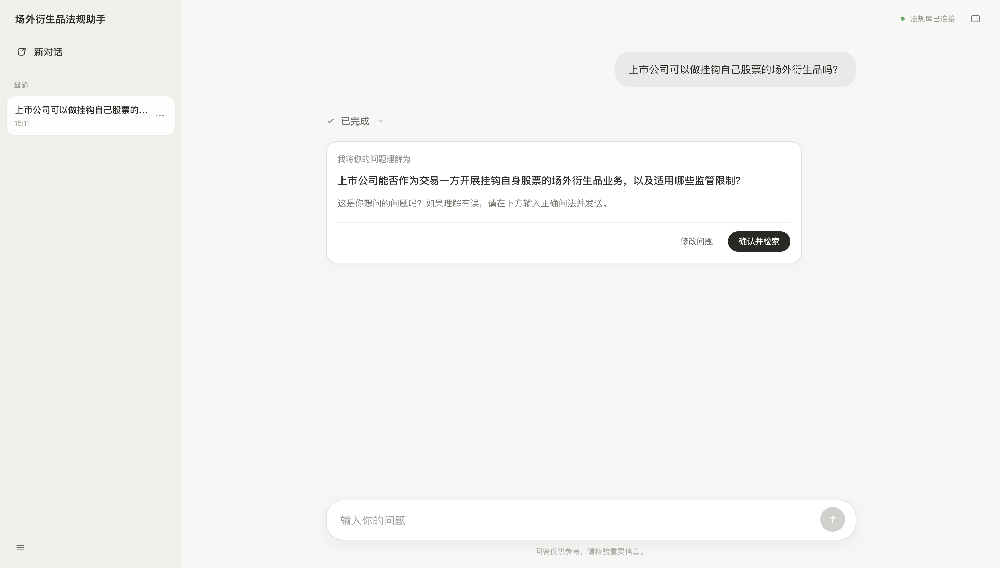
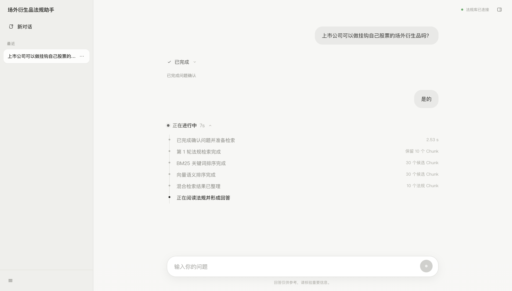
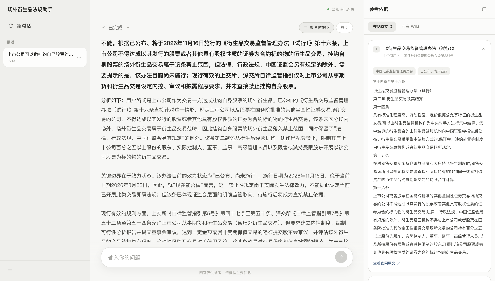
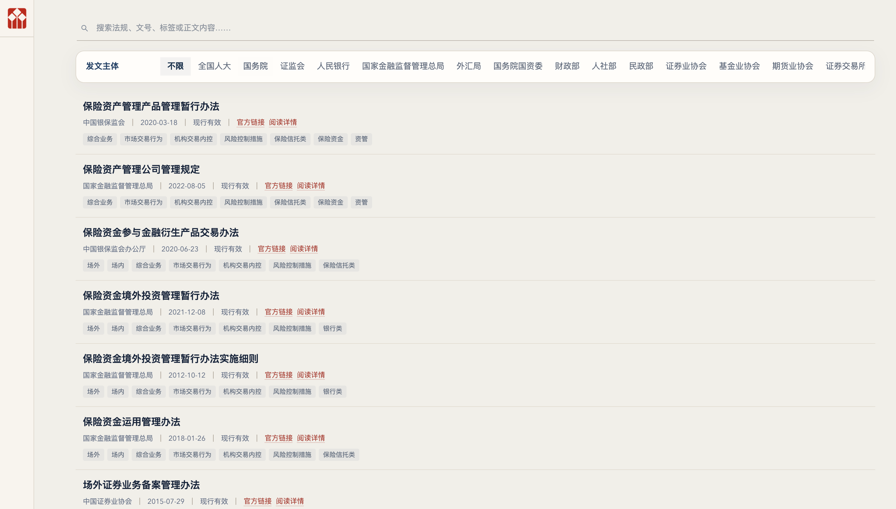
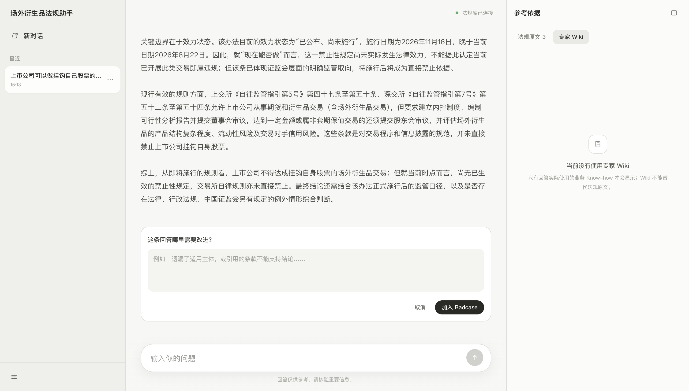
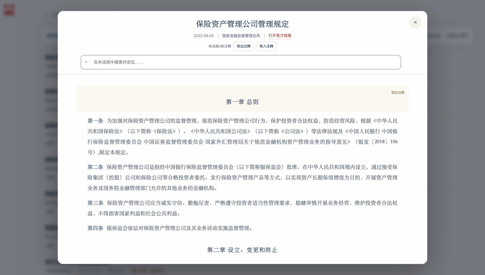

# 场外衍生品法规知识库问答系统

> 把一句口语化的合规问题，变成一条可以回到法规原文的证据链。

这是一个面向证券、基金、期货及场外衍生品业务的法规问答项目。它不把大模型当成“背法规的聊天机器人”，而是先把监管原件整理成可追溯的知识库，再让 Agent 通过混合检索找到相关条文，最后只基于本次检索到的原文回答，并把法规名称、文号、条款范围和官网链接一起展示出来。

## 先看它解决了什么问题

业务人员在实际工作中很少会直接问出一条标准法条，更多时候是这样问：

> “券商收益凭证可以做雪球吗？”

这句话背后可能同时涉及产品结构、发行主体、衍生品资格、投资者范围、损失边界、效力时间和后续自律规则。单纯依赖大模型记忆，容易出现三个问题：

1. 找到了相邻制度，却没有找到真正适用的条文；
2. 把“有一般资格要求”误说成“这个具体产品当然可以做”；
3. 引用了看起来相似的法规，但法规名称和原文实际上对不上。

这个项目把问题拆成一条可检查的链路：



## 当前版本一眼看懂

| 项目 | 当前状态 |
|---|---:|
| 正式法规文件 | 216 份 |
| 结构化法规正文 | 216 份 |
| 正式 Chunk | 2,642 个 |
| 官网链接 | 216 条 |
| 向量模型 | `Xenova/bge-base-zh-v1.5`，768 维 q8 |
| 混合排序 | BM25 + 向量 + 等权 RRF |
| 单轮回答上下文 | 最多 10 个 Chunk |
| 同一法规的上下文上限 | 最多 3 个 Chunk |

以上数字来自当前 `data/processed/build_manifest.json` 和 `data/index/manifest.json`，不是手工填写的宣传数字。

## 这个项目最值得展示的地方

### 1. 从“法规文件”到“可用知识库”

知识库不是把 PDF 丢进一个文件夹就结束了。项目先读取 PDF、DOC、DOCX 中的正文、表格、文本框和 Word smartTag，再识别章、节、条、款、项、附件和公式。

解析后的每一个正文块都有自己的 `source_block_id`，每一个 Chunk 都能回指到来源法规和结构化原文。这样，后续回答引用的不是模型凭记忆生成的“像法规的话”，而是可以沿着 ID 回到原文的内容。

### 2. 切分时优先保护法律语义

Chunk 不是按固定字数机械截断，而是尽量在完整条款、完整分项、完整句子和表格行之间切分。系统会特别避免：

- 把“包括以下内容”“应符合下列条件”等引导语和列表拆开；
- 把“不得……但是……”的例外条件切到下一个 Chunk；
- 把比例、金额、期限、日期、文号和公式截断；
- 把 PDF 跨页造成的视觉换行误识别成新标题；
- 让一个超长法规独占整段回答上下文。

结构化正文和 Chunk 可以在[法规知识库查看器](docs/场外衍生品法规知识库0720.html)中逐份查看；解析和增量构建的证据见[法规正文与增量构建验证报告](docs/reviews/法规正文与增量构建验证报告.md)。

### 3. 关键词和语义两条路一起找

用户说“雪球”，法规可能写“浮动收益凭证”“挂钩标的”“敲入”“敲出”或“内嵌衍生品”。因此项目同时保留两种检索能力：

- **BM25 关键词检索**：擅长找法规名称、文号、专业术语、数字、比例和“不得/应当/除外”等原文措辞；
- **本地向量检索**：擅长找用户说法和法规正式表述之间的语义对应关系；
- **RRF 融合排序**：把两套排名统一成一份结果，不直接把不可比的原始分数硬相加。

两种检索都以 Chunk 为单位。每轮最多返回 10 个 Chunk，同一法规最多 3 个，既保留核心条文，也避免某一份长法规把其他可能相关的制度挤出去。

### 4. Agent 会先确认问题，再决定要不要补检索

用户输入后，Agent 先把口语问题整理成主体、产品、行为和监管边界更清楚的一句话，并在页面中展示出来。用户可以确认，也可以直接改写。

确认后，Agent 使用一个完整问题调用混合检索，而不是把问题写死拆成几个专项关键词。它阅读第一轮证据后，自己判断是否足够；如果缺少关键制度，可以再检索一轮，并保留第一轮仍然相关的证据。

如果原文只规定了一般资格、风控或信息披露要求，却没有直接写明用户问的具体产品“可以”或“不可以”，系统允许回答“现有证据不足以形成确定结论”，同时列出已找到的制度边界和仍缺少的直接依据。这是一个有意保留的合规边界，不是系统失败。

### 5. 引用校验只做客观可验证的事情

回答生成后，程序不再用另一个模型判断法律结论“是否正确”，而只校验：

1. 引用的 evidence ID 是否确实属于本次上下文；
2. `quoteExact` 是否是对应 Chunk 中连续、逐字的原文；
3. 法规名称、文号、发文机关、条款范围和官网链接是否由真实 ID 回填。

这样可以把“法律判断”留给业务人员复核，把“引用有没有编造”变成程序可以明确检查的问题。

## 用一张图看懂实际使用流程

1. 用户在聊天框输入自然语言问题；
2. Agent 展示一版更清楚的问法，等待确认；
3. 页面显示正在检索、BM25 排序、向量排序和证据阅读等处理过程；
4. Agent 返回结论、分析、法规原文和官网链接；
5. 右侧依据栏展示回答真正使用的完整 Chunk；
6. 用户可以复制回答、打开官网，或对回答提交负反馈；
7. 用户补充的业务 Know-how 先形成候选，只有再次确认后才写入 Wiki。

## 页面截图

下面是当前版本的正式界面截图，统一保存在
[`docs/assets/github/`](docs/assets/github/)；每张图的拍摄步骤、脱敏要求和适合放置的位置见
[GitHub 项目说明与截图清单](docs/GitHub项目说明与截图清单.md)。

### 聊天首页：从一个问题开始



页面采用连续对话布局：左侧保留历史对话，中间是问题与回答，用户不需要先学习复杂的检索选项。

### 先确认 Agent 对问题的理解



Agent 会先把口语问题整理成更清楚的问法，再交给用户确认或修改，避免在理解偏差的情况下直接检索。

### 混合检索过程可见



处理中会展示问题确认、BM25 关键词排序、向量语义排序、混合结果整理和证据阅读等阶段，让等待过程可解释。

### 回答与法规依据并列展示



回答区域负责给出结论和分析，右侧依据栏负责展示真实引用的法规原文、条款范围和官网链接，方便逐条核对。

### 法规正文与 Chunk 查看器



查看器用于人工核对法规层级、正文、表格、公式和 Chunk 边界；它与问答页面共享同一套结构化数据。

### Badcase 与专家 Wiki



用户的负反馈会整理为问题、回答和参考依据，进入待复核记录；经过确认的业务 Know-how 才会写入专家 Wiki。

### Chunk、表格与公式保真



法规查看器保留条款边界，并对表格和二维公式做可读化展示，便于人工检查转换是否改变原意。

## 三个真实问题：为什么要允许“证据不足”

项目首版用以下问题做人工回归，不在程序里为它们预置答案或专属 Chunk：

| 问题 | 用来观察什么 |
|---|---|
| 上市公司可以做挂钩自己股票的场外衍生品吗？ | 主体、交易对手、规则生效时间和禁止性条款能否区分 |
| 券商收益凭证可以做雪球吗？ | 一般收益凭证规则能否被误说成对具体雪球结构的直接许可 |
| 私募产品投资雪球比例有明确规定吗？ | 是否能找到 25% 规则，并限制其适用主体和例外 |

这三道题不是产品逻辑的特判，而是用来观察同一套通用流程在不同证据强度下的表现：有直接条文时明确回答，只有相邻制度时说明边界，无法确定时不强行补结论。

## 专家 Wiki：把人的 Know-how 留在系统里

法规能告诉系统“条文写了什么”，但业务人员还会不断补充：一个行业术语在当前团队里通常怎么理解、某种产品结构还需要核对哪些前提、一次回答为什么容易误解。

因此项目保留了一份独立的专家 Wiki：

- Wiki 用于解释术语、业务语境和检索方向；
- Wiki 不能替代法规原文，也不能单独支撑确定性的法律结论；
- 用户补充 Know-how 后，系统先展示候选内容；
- 用户明确确认后才写入，且保存的是页面刚刚展示的候选快照。

这让项目不只是“一次性 RAG Demo”，而是可以随着真实工作不断积累经验的法规工作台。

## 仓库结构

```text
apps/api/                 NestJS API：Agent、检索、引用校验、Wiki
apps/web/                 Next.js 聊天界面、处理过程和依据侧栏
packages/shared/          API 类型与 Zod schema
packages/prompts/         问题改写、检索、回答等通用 Prompt
knowledge_base/           PDF/DOC/DOCX 解析、清洗、结构化和 Chunk
data/raw/监管文件/        原始法规原件，只读输入
data/processed/           结构化 JSON 与正式 all_chunks.jsonl
data/index/               BM25、向量、语料和构建清单
wiki/                     经用户确认的专家 Know-how
docs/                     架构、审查报告、迭代记录、查看器和截图清单
scripts/                  索引构建、检索测试和链路核验脚本
```

## 本地运行

环境要求：Node.js 20+、pnpm 10+、Python 3.11+。

```bash
corepack enable
pnpm install
python3 -m venv .venv
source .venv/bin/activate
pip install -r requirements.txt
cp .env.example .env
```

在 `.env` 中填写兼容 `/chat/completions` 的 `LLM_API_KEY` 后启动：

```bash
pnpm dev:api   # http://127.0.0.1:4000/api
pnpm dev:web   # http://127.0.0.1:3000
```

打开 `http://127.0.0.1:3000`，输入问题，确认 Agent 的改写，再观察检索和回答过程。API Key 不应写入代码、截图或 Git 提交。

## 新增法规时怎么更新

```bash
python knowledge_base/main.py --input-dir data/raw/监管文件 --output-dir data/processed/chunks
pnpm build:retrieval
```

结构化 JSON 会记录清洗规则版本、原文与清洗后哈希、移出的 block 和字符变化；BM25 与向量索引都从正式 `all_chunks.jsonl` 重建。原始文件不在解析过程中被覆盖。

## 验证与文档入口

```bash
pnpm test
pnpm build
python3 -m unittest discover -s knowledge_base/tests -v
```

> `docs/reviews/` 中的报告保留了各轮人工复核的历史快照；README 顶部的当前规模以 `data/processed/build_manifest.json` 和 `data/index/manifest.json` 为准。

- [GitHub 项目说明与截图清单](docs/GitHub项目说明与截图清单.md)：README 如何展示、需要截哪些图、截图如何命名和脱敏；
- [项目整体逻辑说明](docs/architecture/项目整体逻辑说明.md)：从法规原件到回答的完整业务逻辑；
- [问答与检索架构](docs/architecture/问答与检索架构.md)：Agent、混合检索、引用校验和 Wiki 边界；
- [项目迭代记录](docs/项目迭代记录.md)：每轮为什么改、改了什么、如何验证；
- [Chunk 复核报告](docs/reviews/Chunk复核报告.md)：切分质量与原文追溯结果；
- [法规正文与增量构建验证报告](docs/reviews/法规正文与增量构建验证报告.md)：正文、表格、公式和索引更新证据；
- [法规知识库查看器](docs/场外衍生品法规知识库0720.html)：按发文主体、效力状态、业务分类和格式查看法规及 Chunk。

## 项目边界

这是一个法规检索、证据整理和回答辅助系统，不替代法律意见、合规审批或最新监管口径确认。法规效力、主体适用范围、产品结构和交易安排发生变化时，仍需要业务人员结合最新官网文件进行判断。

如果你希望复用这套方法，最有价值的起点不是复制某一道题的答案，而是查看解析器、Chunk、检索日志和回答引用能否完整连起来。
