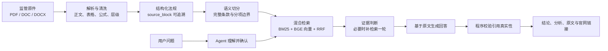

# 场外衍生品法规知识库问答系统

> 将自然语言合规问题与监管法规原文建立可追溯关联。

这是一个面向证券、基金、期货及场外衍生品业务的法规问答项目。系统以监管原件和结构化法规为知识底座，通过混合检索获取相关条文，再依据本次检索到的原文生成回答，并展示法规名称、文号、条款范围和官网链接。

## 项目定位与问题背景

业务人员在实际工作中很少会直接问出一条标准法条，更多时候是这样问：

> “券商收益凭证可以做雪球吗？”

这句话背后可能同时涉及产品结构、发行主体、衍生品资格、投资者范围、损失边界、效力时间和后续自律规则。单纯依赖大模型记忆，容易出现三个问题：

1. 找到了相邻制度，却没有找到真正适用的条文；
2. 把“有一般资格要求”误说成“这个具体产品当然可以做”；
3. 引用了看起来相似的法规，但法规名称和原文实际上对不上。

系统处理链路如下：



## 当前版本数据

| 项目 | 统计值 |
|---|---:|
| 原始法规目录文件（含2份仅归档附件） | 218 份 |
| 正式纳入法规文件 | 216 份 |
| 结构化法规正文 | 216 份 |
| 正式 Chunk | 2,642 个 |
| 官网链接 | 216 条 |
| 向量模型 | `Xenova/bge-base-zh-v1.5`，768 维 q8 |
| 混合排序 | BM25 + 向量 + 等权 RRF |
| 单轮回答上下文 | 最多 10 个 Chunk |
| 同一法规的上下文上限 | 最多 3 个 Chunk |

以上数字直接读取当前 `data/processed/build_manifest.json` 和 `data/index/manifest.json`。原始目录中的2份附件正文已经完整内嵌在主法规中，作为归档原件保留，由主法规承载结构化正文、Chunk和检索记录；因此“原始目录文件”与“正式纳入法规文件”相差2份。

上述原始文件、216份结构化文档、正式 `all_chunks.jsonl`、BM25索引、向量矩阵和交付HTML/Excel均已纳入仓库版本控制，克隆后即可使用现成法规数据和索引；按下方步骤初始化本地向量模型缓存即可启用完整混合检索。

## 主要功能

### 1. 法规原件处理与结构化

法规文件先经过解析、清洗和结构识别。系统读取 PDF、DOC、DOCX 中的正文、表格、文本框和 Word smartTag，并识别章、节、条、款、项、附件和公式。

解析后的每个正文块都有唯一的 `source_block_id`，每个 Chunk 均可回溯至所属法规和结构化原文。回答引用的正文可以通过该标识回到原始材料。

### 2. Chunk 切分规则

Chunk 按完整条款、完整分项、完整句子和表格行等语义边界切分，并以结构完整和引用准确为优先。处理时重点保证：

- “包括以下内容”“应符合下列条件”等引导语与列表保持在同一语义块；
- “不得……但是……”的主规则与例外条件保持在同一语义块；
- 比例、金额、期限、日期、文号和公式完整保留；
- PDF跨页造成的视觉换行按正文结构恢复；
- 超长法规按结构分散到多个可检索上下文。

结构化正文和 Chunk 可以在[法规知识库小工具](deliverables/场外衍生品法规知识库_20260727.html)中逐份查看；当前HTML列表每页显示8部法规，筛选器只保留“发文主体”和“收藏”，卡片不再展示分类标签。七维分类映射、逐标签证据和审计Excel仍保存在 `data/metadata/` 与 `deliverables/`，解析、增量构建和评测证据见[项目迭代记录](docs/history/项目迭代记录.md)。

### 3. 混合检索

用户说“雪球”，法规可能写“浮动收益凭证”“挂钩标的”“敲入”“敲出”或“内嵌衍生品”。因此项目同时保留两种检索能力：

- **BM25 关键词检索**：擅长找法规名称、文号、专业术语、数字、比例和“不得/应当/除外”等原文措辞；
- **本地向量检索**：擅长找用户说法和法规正式表述之间的语义对应关系；
- **RRF 融合排序**：把两套排名统一成一份结果，保留BM25和向量各自的排名口径。

两种检索都以 Chunk 为单位。每轮最多返回 10 个 Chunk，同一法规最多 3 个，既保留核心条文，也避免某一份长法规把其他可能相关的制度挤出去。

### 4. Agent 问题确认与证据补检索

用户输入后，Agent 先把口语问题整理成主体、产品、行为和监管边界更清楚的一句话，并呈现在页面中。用户可以确认，也可以直接改写。

确认后，Agent 以一个完整问题调用混合检索，并根据第一轮证据判断是否需要补检索；补充时保留第一轮仍然相关的证据，再合并第二轮结果。

如果检索结果覆盖的是一般资格、风控或信息披露要求，系统会明确标注证据边界：对于用户问的具体产品，只有直接条文足以支持“可以”或“不可以”时才给出确定结论；其余情况列出已找到的制度边界和需要补充的直接依据。

### 5. 引用校验只做客观可验证的事情

回答生成后，程序执行客观可验证的引用校验：

1. 引用的 evidence ID 是否确实属于本次上下文；
2. `quoteExact` 是否是对应 Chunk 中连续、逐字的原文；
3. 法规名称、文号、发文机关、条款范围和官网链接是否由真实 ID 回填。

这样既保留业务人员对法律判断的复核空间，也把引用真实性变成程序可以明确检查的结果。

## 使用流程

1. 用户在聊天框输入自然语言问题；
2. 页面呈现整理后的问法，等待用户确认；
3. 页面显示正在检索、BM25 排序、向量排序和证据阅读等处理过程；
4. Agent 返回结论、分析、法规原文和官网链接；
5. 右侧依据栏展示回答真正使用的完整 Chunk；
6. 用户可以复制回答、打开官网，或对回答提交负反馈；
7. 用户补充的业务 Know-how 先形成候选，只有再次确认后才写入 Wiki。

## 页面截图

下面是当前版本的正式界面截图，统一保存在
[`docs/assets/github/`](docs/assets/github/)；每张图的拍摄步骤、脱敏要求和适合放置的位置见
[GitHub 项目说明与截图清单](docs/guides/GitHub项目说明与截图清单.md)。

### 聊天首页


页面采用连续对话布局：左侧保留历史对话，中间是问题与回答，用户直接输入自然语言即可开始使用。

### 问题确认


Agent 会先把口语问题整理成更清楚的问法，再交给用户确认或修改，避免在理解偏差的情况下直接检索。

### 检索过程


处理中会展示问题确认、BM25 关键词排序、向量语义排序、混合结果整理和证据阅读等阶段，用户可以查看各阶段的处理状态。

### 回答与法规依据


回答区域展示结论和分析，右侧依据栏展示引用的法规原文、条款范围和官网链接，供人工核对。

### 法规正文与 Chunk 查看器


查看器用于人工核对法规层级、正文、表格、公式和 Chunk 边界；它与问答页面共享同一套结构化数据。

### Badcase 与专家 Wiki


用户的负反馈会整理为问题、回答和参考依据，形成待复核记录；经确认的业务 Know-how 才会写入专家 Wiki。

### Chunk、表格与公式保真


法规查看器保留条款边界，并对表格和二维公式做可读化展示，便于人工检查转换是否改变原意。

## 回归问题与证据不足处理

项目首版用以下问题做人工回归，程序统一使用通用Agent、检索和引用链路：

| 问题 | 用来观察什么 |
|---|---|
| 上市公司可以做挂钩自己股票的场外衍生品吗？ | 主体、交易对手、规则生效时间和禁止性条款能否区分 |
| 券商收益凭证可以做雪球吗？ | 一般收益凭证规则能否被误说成对具体雪球结构的直接许可 |
| 私募产品投资雪球比例有明确规定吗？ | 是否能找到 25% 规则，并限制其适用主体和例外 |

这三道题作为不同证据强度的回归样本：有直接条文时给出明确回答，只有相邻制度时说明适用边界，证据不足时保留确定性边界。

## 专家 Wiki

法规能告诉系统“条文写了什么”，但业务人员还会不断补充：一个行业术语在当前团队里通常怎么理解、某种产品结构还需要核对哪些前提、一次回答为什么容易误解。

因此项目保留了一份独立的专家 Wiki：

- Wiki 用于解释术语、业务语境和检索方向；确定性法律结论以法规原文为依据；
- 用户补充 Know-how 后，系统先展示候选内容；
- 用户明确确认后才写入，且保存的是页面刚刚展示的候选快照。

该机制用于在法规检索之外保存经确认的业务知识，并与法规原文、法律判断保持职责分工。

## 仓库结构

```text
apps/api/                 NestJS API：Agent、检索、引用校验、Wiki
apps/web/                 Next.js 聊天界面、处理过程和依据侧栏
packages/shared/          API 类型与 Zod schema
packages/prompts/         问题改写、检索、回答等通用 Prompt
knowledge_base/           PDF/DOC/DOCX 解析、清洗、结构化和 Chunk
data/raw/监管文件/        原始法规原件，只读输入
data/processed/           结构化 JSON 与正式 all_chunks.jsonl
data/index/               BM25、向量、语料和构建清单
deliverables/             最终HTML、分类Excel、法规清单和使用说明
evaluation/questions/     200题评测题库
evaluation/results/       基线、全量复测和关键题目迭代证据
wiki/                     经用户确认的专家 Know-how
docs/architecture/        项目架构与问答检索逻辑
docs/guides/              使用、标注和GitHub展示指南
docs/history/             项目迭代与质量验证记录
docs/assets/              README和历史迭代截图
scripts/                  索引构建、检索测试和链路核验脚本
```

## 本地运行

环境要求：Node.js 20+、pnpm 10+、Python 3.10+。

```bash
git clone https://github.com/tank798/OTC-Derivatives-Knowledge-Base-new.git
cd OTC-Derivatives-Knowledge-Base-new
corepack enable
pnpm install
pnpm download:retrieval-model
python3 -m venv .venv
source .venv/bin/activate
pip install -r requirements.txt
cp .env.example .env
```

仓库已经包含正式法规原件、结构化正文、`all_chunks.jsonl`、BM25索引和向量矩阵；运行上面的下载命令即可初始化项目声明版本的本地向量模型，API同时保留BM25关键词检索回退路径。

在 `.env` 中填写兼容 `/chat/completions` 的 `LLM_API_KEY`（也可以同时调整 `LLM_BASE_URL`、`LLM_MODEL` 和 `LLM_FAST_MODEL`）后，在两个终端分别启动：

这里的“兼容”包括请求格式和工具调用能力；更换服务商时，同时配置其兼容接口地址、可用模型和对应的API Key即可。

```bash
pnpm dev:api   # http://127.0.0.1:4000/api
pnpm dev:web   # http://127.0.0.1:3000
```

打开 `http://127.0.0.1:3000`，输入问题，确认 Agent 的改写，再观察检索和回答过程。API Key通过环境变量注入，代码、截图和Git提交均保持脱敏。

## 新增法规时怎么更新

```bash
python knowledge_base/main.py --input-dir data/raw/监管文件 --output-dir data/processed/chunks
pnpm build:retrieval
```

结构化 JSON 会记录清洗规则版本、原文与清洗后哈希、移出的 block 和字符变化；BM25与向量索引都从正式 `all_chunks.jsonl` 重建，解析过程保持原始文件完整。

## 验证与文档入口

```bash
pnpm test
pnpm build
python3 -m unittest discover -s knowledge_base/tests -v
```

Python解析与测试需要Python 3.10或更高版本；已构建的Node.js API和Web界面可直接使用版本化法规数据与索引。

> 当前规模以 `data/processed/build_manifest.json` 和 `data/index/manifest.json` 为准；历史验证结论集中保留在项目迭代记录中。

- [GitHub 项目说明与截图清单](docs/guides/GitHub项目说明与截图清单.md)：README 如何展示、需要截哪些图、截图如何命名和脱敏；
- [项目整体逻辑说明](docs/architecture/项目整体逻辑说明.md)：从法规原件到回答的完整业务逻辑；
- [问答与检索架构](docs/architecture/问答与检索架构.md)：Agent、混合检索、引用校验和 Wiki 边界；
- [项目迭代记录](docs/history/项目迭代记录.md)：每轮为什么改、改了什么、如何验证；
- [新增法规与知识库十轮迭代记录](docs/history/新增法规与知识库十轮迭代记录_20260724.md)：新增法规、正文、Chunk、索引、分类和真实问答链路的集中验证记录；
- [个人标注同步](docs/guides/个人标注同步.md)：将Word、PDF批注导入或嵌入本地法规HTML；
- [法规知识库小工具](deliverables/场外衍生品法规知识库_20260727.html)：搜索、收藏、阅读和个性化标注法规正文。

## 项目边界

这是一个法规检索、证据整理和回答辅助系统；最终法律意见、合规审批和最新监管口径确认由业务人员结合最新官网文件完成。法规效力、主体适用范围、产品结构和交易安排发生变化时，应及时复核。

如需复用这套方法，应先核对解析器、Chunk、检索日志和回答引用是否能够完整关联。
