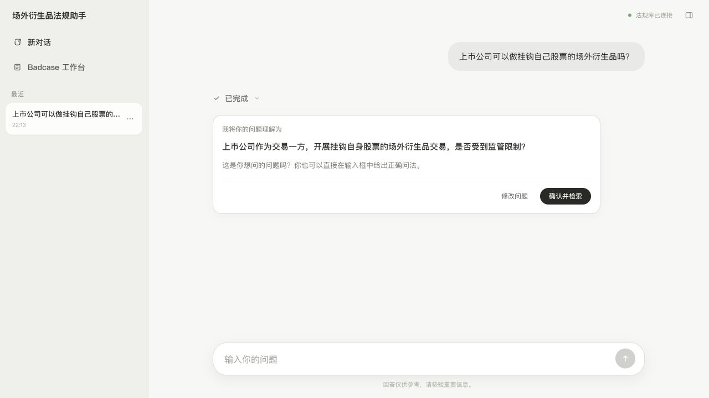
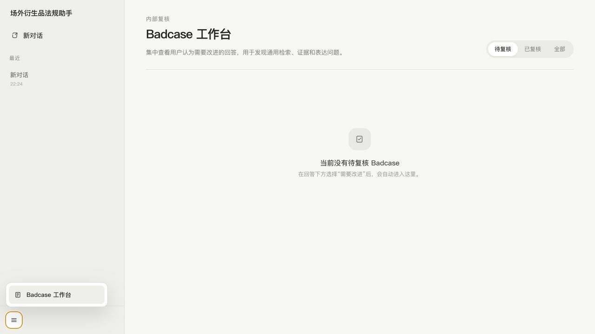
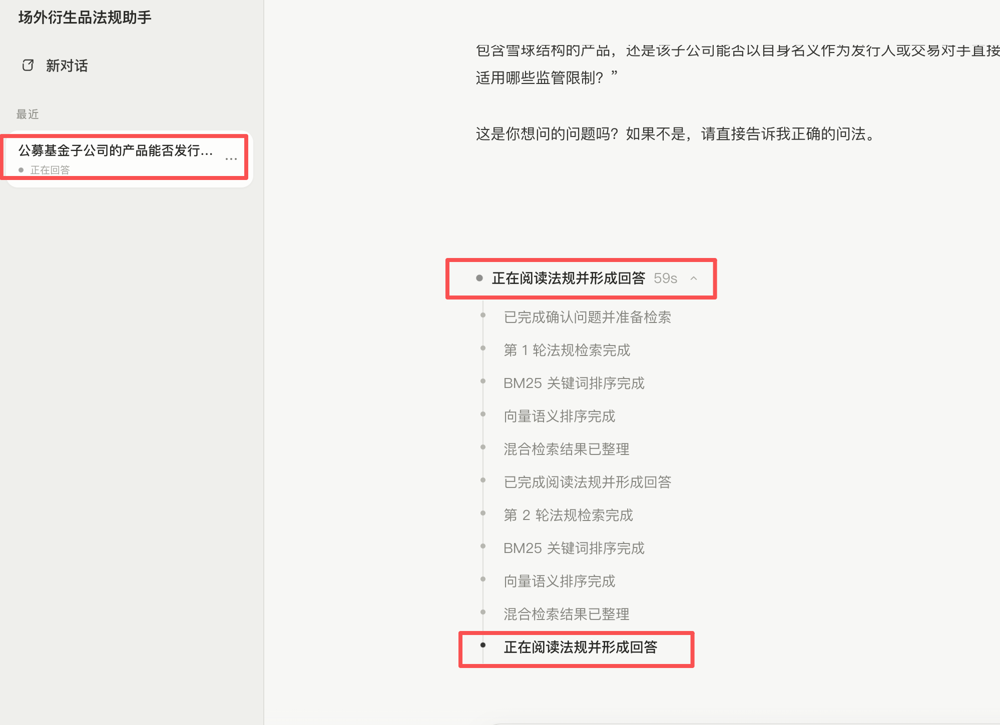
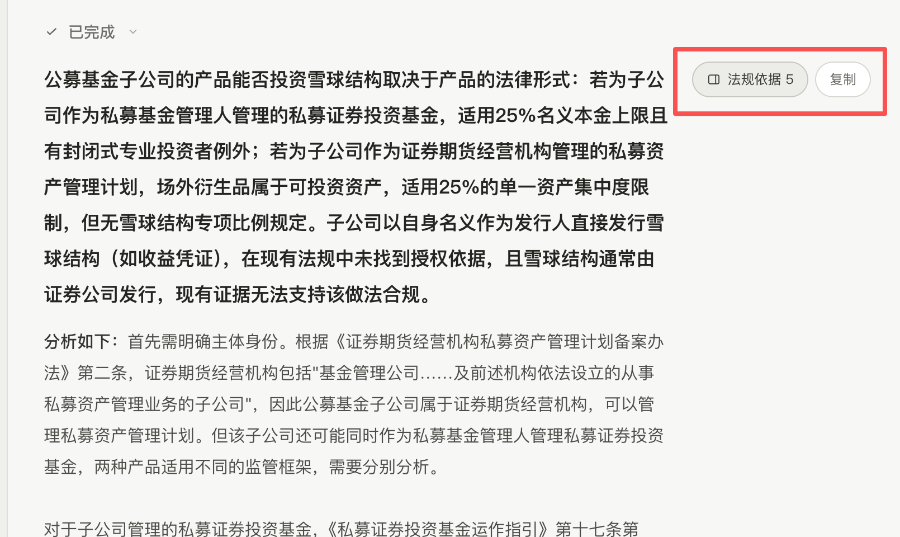

# 项目迭代记录

本文件记录每次阶段性迭代的目标、主要变化、验证结果和遗留边界。UI 有明显变化时，在 `docs/assets/iterations/` 保存截图并在对应版本中引用。

## 2026-07-19：法规增量更新与可追溯清洗

### 这次改了什么

- 正式法规库更新为114份，结构化正文同步更新为114份，共形成1,700个Chunk。
- 新增证券公司柜台交易规范，以及深交所、上交所股票期权证券公司/期货公司经纪与自营业务指南。
- 对法规正文前的封面标题、文号、发布套语、修订说明、机构名和日期采用统一的结构规则处理；这些内容仍保留在元数据或清洗日志中，但不再挤占正文检索。本次共有45份法规命中清洗规则，其中39份为既有法规、6份为新增法规。
- Word解析改为先识别真实文件容器，兼容扩展名为`.doc`但内部实际为OOXML的文件，以及宏启用Word包。
- BM25按全部1,700个Chunk重建；向量按“Chunk ID＋向量输入哈希”增量更新，复用1,183个未变化向量，新计算517个新增或变化Chunk，更新前45个已删除或变化向量退出。
- 唯一静态入口更新为[场外衍生品法规知识库](场外衍生品法规知识库.html)，保留现有页面交互和业务分类，并换成正式Chunk数据。

### 验证

- 114份法规全部解析成功，无OCR待处理或失败文件。
- 1,700个Chunk ID全部唯一；自动质量检查无严重或重大问题。
- 70项Python解析与查看器测试通过。
- BM25、向量行号、法规名称和文号召回测试通过。
- 对新增7份法规逐份检查首尾正文、目录清理、发布日期、官网链接和Chunk数量。

---

## 2026-07-18：提问确认、回答反馈与 Badcase 工作台

### 这次改了什么

- Agent 展示改写问题后，页面提供“确认并检索”和“修改问题”两个明确入口；用户仍可直接用自然语言确认或纠正，不增加写死的意图路由。
- 用户确认或在下方发送正确问法后，确认卡自动折叠为一行历史记录，不继续占用正文空间。
- 每条完成的回答增加轻量反馈入口。正向反馈保留在对话中；选择“需要改进”时可填写具体原因。
- 负反馈只在当前对话中记录，不自动跳转；Badcase 保存原问题、当时回答，以及法规原文或专家Wiki的完整引用快照。
- Badcase 入口收进左下角三横线菜单；工作台内每条记录按“问题—回答—参考依据”三部分展示。
- 工作台支持待复核、已复核和全部筛选，可标记已复核、重新打开或删除。
- 点击首页推荐问题后，输入框获得焦点，光标和可视位置都定位在问题末尾。
- 运行计时不足1分钟显示秒，达到1分钟后显示分、秒，达到1小时后显示时、分、秒；计时基于真实经过时间，避免页面卡顿造成累计偏差。
- 参考依据侧栏删除“法规数·Chunk数”汇总，面向用户统一使用“引用”，不再展示内部 Chunk 术语。

### UI

### 验证

- Web TypeScript 类型检查通过。
- Next.js 生产构建通过。
- 本地页面返回 HTTP 200，浏览器控制台无相关错误。
- 浏览器实测推荐问题填入后，输入框处于焦点状态，光标起止位置均等于文本长度。
- 真实调用问题改写模型后，确认卡正确展示“修改问题”和“确认并检索”；点击“修改问题”后，光标同样定位到改写问题末尾。
- 浏览器实测左侧工作台入口、空状态和筛选按钮正常显示。

---

## 2026-07-17：Chunk 召回回归修复、专家 Wiki 与多对话并行

### 为什么改

上一版为了补充长法规的制度背景，引入了整篇法规 BM25，并把同一法规硬限制为最多2个 Chunk。实际运行发现，这会让长文中的通用词抬高无关法规，同时把核心法规的第3、4条直接证据挤出前10。问题改写也会把一句清楚的问题扩展为多个法律角色，导致检索意图被稀释。

另外，页面把任意一个对话的运行状态当成全局状态，导致一个对话回答时，其他对话以及当前对话的输入框都不能继续输入。

### 这次改了什么

- 恢复以 Chunk 为单位的 BM25＋向量检索＋RRF 主排序，整篇法规 BM25 不再参与主排序。
- 最终上下文最多10个 Chunk；同一法规最多3个，避免单一长法规占满回答上下文。
- 问题改写回到轻量规范化；只有确实会改变适用规则的角色歧义才追问，不把所有可能角色塞进一个检索问题。
- 用户明确纠正回答或补充业务口径时，Agent 可整理为 Wiki 候选；必须再次由用户确认后才写入本地 Wiki。
- 用户确认时只保存页面刚刚展示的候选快照，模型不能在确认后改写内容；Wiki 作为不可信业务资料隔离传入，不能改变系统指令。
- Wiki 与法规分开：Wiki 只帮助解释术语、业务实践和检索方向，确定性法律结论仍必须由法规 Chunk 支持。
- 运行状态按对话隔离。不同对话可同时请求；当前对话运行时输入框仍可编辑并保存草稿，同一对话仍只执行一个请求。
- 右侧依据栏分为“法规原文”和“专家 Wiki”；法规继续展示模型实际引用的完整 Chunk。
- 常用文档集中到 `docs/`，新增本文件与文档导航；正式数据目录保持不变。

### UI 对比

调整前，运行状态集中在一个全局流程中，且缺少 Wiki 确认卡片与分栏依据：

调整后，回答、处理状态和依据入口使用同一内容宽度，法规原文集中在可展开的右侧栏：

### 验证

- Chunk 检索单元测试：10项通过。
- API 合约测试：13项通过，覆盖未经确认不得写入、候选快照不可篡改、Wiki 提示注入隔离、同一会话并发门禁和向量模型并发初始化。
- 文档解析、Chunk 与查看器 Python 测试：61项通过。
- 通用检索抽查：商业银行衍生品准入、保证金再使用、基金信用衍生品估值3个未参与参数调整的问题均返回10个 Chunk，任一法规不超过3个。
- TypeScript：shared、prompts、API、Web 均通过类型检查。
- 生产构建：API 与 Web 均通过。
- 真实 DeepSeek API 与浏览器自动化验收：本轮执行环境的外网/本地端口授权额度不足，代码已发起真实调用但被网络沙箱拦截；需在可联网环境补跑 `pnpm test:live-agent`，不能把该项记为已通过。

### 边界

- 每份法规最多3个 Chunk 是统一的通用约束；若后续盲评证明复杂问题需要更多同文条款，应调整全局策略，而不能为某一道题设置例外。
- 用户确认的 Wiki 条目初始状态为“待专家复核”；它可以辅助理解，但不会覆盖法规原文。

---

## 2026-07-16：聊天式 Agent 与法规依据侧栏

- 把固定问答页改为接近 ChatGPT 的连续对话界面，增加历史对话、新对话和本地保存。
- Agent 先改写问题并请用户确认，再做最多两轮混合检索、回答和程序化引用真实性校验。
- 回答先给直接判断，再用“分析如下”展开；删除重复的“当前仍缺少”和“复核提示”板块。
- 右侧依据栏按法规合并显示，去除重复卡片、内部 Chunk ID 和分析性说明，只显示模型实际引用的完整 Chunk 与官网链接。
- 运行过程显示问题理解、BM25、向量、RRF、证据阅读和引用校验状态，并使用轻量呼吸动效。

## 2026-07-14：混合检索和真实问答链路

- 建立中文 BM25、本地向量检索和 RRF 融合；每轮检索只接收一个完整自然语言问题。
- 将问答上下文限制为最多10个 Chunk，允许第二轮补充检索并保留第一轮仍相关证据。
- 接入 DeepSeek Pro 负责证据判断和回答，Flash 用于问题改写等较轻步骤。
- 增加运行日志，记录模型调用、检索排名、证据 ID、耗时和失败原因。

## 2026-07-13：Chunk 质量修复与静态查看器

- 完成108份监管文件的结构化转换与 Chunk 复核，正式语料形成1228个 Chunk。
- 修复条款编号断行、页内硬换行、旧 DOC 前言遗漏和部分 PDF 公式保真问题。
- 建立法规与 Chunk 静态查看器，支持发文主体、状态、格式、关键词筛选及 Chunk 手风琴展开。
- 删除独立的监管文件总目录页面，统一以 Chunk 查看器作为唯一法规浏览入口。
